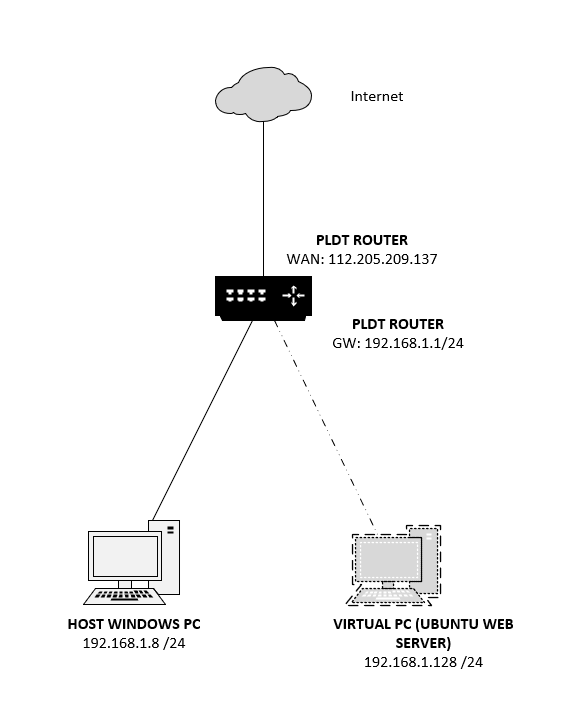

# Linux & Nginx Web Server

A hands-on infrastructure project documenting the deployment of a Linux-based web server using **Ubuntu Linux and Nginx**, including network configuration, routing, NAT, port forwarding, DNS, HTTPS, and Linux server administration.

The project uses an **Ubuntu Linux virtual machine running on VMware Workstation** as a web server. The server is connected to the home LAN and is made accessible from the public internet through the PLDT router.

The primary focus of this project is understanding the **Linux and networking infrastructure behind a publicly accessible web server**.

---

## 📌 Project Overview

This project demonstrates how a Linux server can be deployed and exposed to the internet from a private network.

The environment includes:

- Ubuntu Linux
- VMware Workstation
- Nginx
- IPv4 networking
- Static IP addressing
- Default gateway configuration
- NAT
- Router port forwarding
- DNS
- HTTPS/TLS
- Linux system administration
- React/Vite web application

The project is designed as a practical exercise in **Linux server administration and network infrastructure**.

---

## 🏗️ Network Architecture

The following diagram shows the network topology used in this project.



*Figure 1 — Linux Web Server Network Architecture*

### Network Components

| Device | Role | IP Address |
|---|---|---|
| Internet | External network | Public network |
| PLDT Router | Default gateway / NAT / Port Forwarding | `192.168.1.1/24` |
| Windows Host PC | VMware host | `192.168.1.8/24` |
| Ubuntu VM | Web server | `192.168.1.128/24` |

The Ubuntu virtual machine is connected to the same `192.168.1.0/24` LAN as the Windows host.

The Ubuntu server uses the PLDT router as its **default gateway**:

```text
Ubuntu Server
192.168.1.128/24
        |
        | Default Gateway
        v
PLDT Router
192.168.1.1/24
        |
        | NAT
        v
Internet