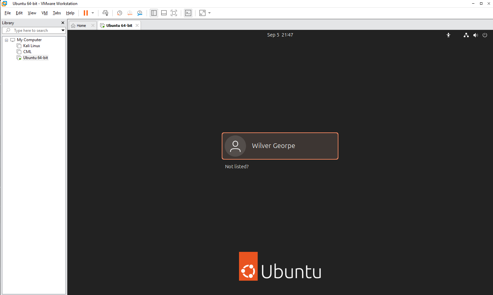
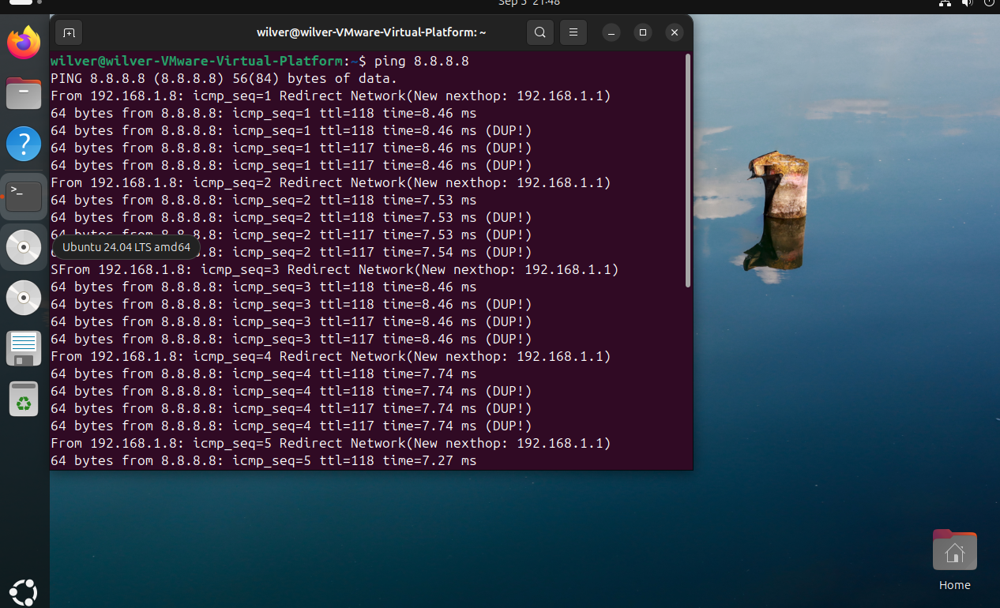
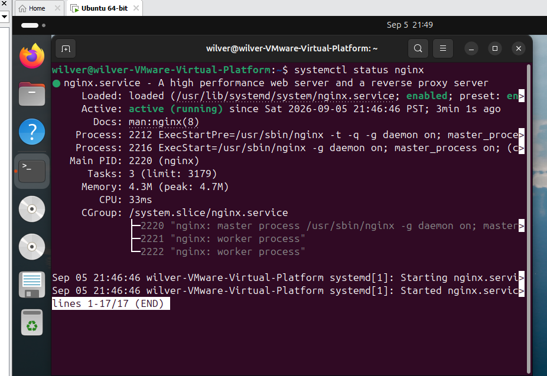

# Linux Server Setup

This document records the setup of the Ubuntu Linux virtual machine used as the web server for this project.

The Ubuntu server runs inside VMware Workstation on the Windows host and is used to host the web portfolio through Nginx.

---

## 1. Server Environment

The project uses the following environment:

| Component | Configuration |
|---|---|
| Host OS | Windows |
| Hypervisor | VMware Workstation |
| Server OS | Ubuntu Linux |
| Server Role | Web Server |
| Server IP | 192.168.1.128 |
| Network | 192.168.1.0/24 |
| Default Gateway | 192.168.1.1 |

The Ubuntu VM is connected to the same LAN as the Windows host.

---

## 2. Ubuntu Virtual Machine

The Ubuntu server was deployed as a virtual machine using VMware Workstation.

The virtualization structure is:

    Windows Host
         |
         v
    VMware Workstation
         |
         v
    Ubuntu Linux VM
         |
         v
    Web Server

The Ubuntu VM provides the Linux environment used for the rest of the project.

---

## 3. Ubuntu Installation

Ubuntu Linux was installed on the VMware virtual machine using an Ubuntu installation ISO.

After completing the installation, the server was booted into Ubuntu and administered primarily through the terminal.

The Linux terminal was used for:

- System configuration
- Network configuration
- Software installation
- Nginx configuration
- Service management
- Troubleshooting

---

## 4. System Update

After installing Ubuntu, the system package information was updated:

    sudo apt update

Available packages were then upgraded:

    sudo apt upgrade

This ensured that the newly installed Ubuntu system was up to date before continuing with the server configuration.

---

## 5. Network Configuration

The Ubuntu server was configured with a static IPv4 address so that the router could consistently forward incoming traffic to the correct server.

The final network configuration is:

    IP Address:      192.168.1.128
    Subnet Mask:     255.255.255.0
    Prefix Length:   /24
    Default Gateway: 192.168.1.1

The server is therefore part of the:

    192.168.1.0/24

network.

Detailed network configuration is documented separately:

➡️ [Network Configuration](02-network-configuration.md)

---

## 6. Verifying the Network Interface

The configured network interface and IP address were checked using:

    ip addr

The routing table was checked using:

    ip route

This was used to verify that the Ubuntu server had the expected IP address and default gateway.

---

## 7. Testing Connectivity

Connectivity from the Ubuntu server was tested using:

    ping 8.8.8.8

This verified that the server could reach an external IP address through the configured default gateway.

DNS connectivity was also tested by using a hostname:

    ping google.com

This helped verify both external network connectivity and DNS resolution.

---

## 8. Installing and Managing Server Software

The Ubuntu server was used as the environment for installing and running the software required by the project.

The main server component installed later in the project was Nginx.

Nginx is managed as a Linux system service using `systemctl`.

For example, its status was checked using:

    sudo systemctl status nginx

The Nginx service was also restarted or reloaded when configuration changes were made.

---

## 9. Checking Listening Services

The `ss` command was used to inspect network sockets and listening services:

    sudo ss -tulpn

This was useful for verifying whether services such as Nginx were actually listening for incoming connections on the expected ports.

---

## 10. Linux Server Administration

The server was administered directly through the Ubuntu command line.

Some of the commands used throughout the project include:

    sudo apt update
    sudo apt upgrade
    ip addr
    ip route
    ping
    ss
    systemctl

These commands were used to configure, verify, and troubleshoot the server during deployment.

---

## 11. Role of the Ubuntu Server

The Ubuntu VM became the server-side infrastructure for the web portfolio.

The resulting architecture is:

    Windows Host
         |
         v
    VMware Workstation
         |
         v
    Ubuntu Linux
    192.168.1.128
         |
         v
       Nginx
         |
         v
    Web Application

The Ubuntu server is responsible for providing the environment in which Nginx serves the deployed web application.

---

## 12. Verification

Before continuing with the web server configuration, the following were verified:

- Ubuntu was successfully installed.
- The system was updated.
- The server had the expected static IP address.
- The default gateway was configured.
- The server could reach an external IP address.
- DNS resolution was working.
- Linux networking commands could be used to inspect the server.
- The server environment was ready for Nginx installation.

---

## Key Concepts

This stage of the project provided hands-on experience with:

- Ubuntu Linux
- VMware virtualization
- Linux command-line administration
- `apt` package management
- Static IPv4 configuration
- Default gateways
- Linux routing tables
- Network connectivity testing
- DNS resolution
- Linux service management
- Network socket inspection

The next stage focuses specifically on the Linux network configuration used by the server.

---

## Next Documentation

➡️ [Network Configuration](02-network-configuration.md)

➡️ [Nginx Installation](03-nginx-installation.md)